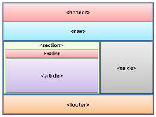

# Introductory HTML and JavaScript ...

### HTML 

HTML Describes the Structure of Pages.

 HTML is HyperText Markup Language, it's the markup language used to create the structure of the web pages.

The Structure of HTML:

_____________________________________________________________________

## EXTRA MARKUP

+ DOCTYPES tell browsers which version of HTML you are using.

+ You can add comments to your code between the <!-- and --> markers.

+ The id and class attributes allow you to identify particular elements.

+  The div and span elements allow you to group block-level and inline elements together.

+  iframes cut windows into your web pages through which other pages can be displayed.

+  The meta tag allows you to supply all kinds of information about your web page.

+  Escape characters are used to include special characters in your pages such as <, >, and ©.

_______________________________________________________________________________

## Html5 Layout Elements :

## Process & Design :

* It's important to understand who your target audience is,
 why they would come to your site, what information they want to find and when they are likely to return.

* Site maps allow you to plan the structure of a site.

* Wireframes allow you to organize the information that will need to go on each page.

* Design is about communication. Visual hierarchy helps visitors understand what you are trying to tell them.

* You can differentiate between pieces of information using size, color, and style. 

* You can use grouping and similarity to help simplify the information you present.

________________________________________________________________________________

## Javascript

Javascript is a programming language that allows you to make the web pages interactive.

it's convert a web page from static to dynamic, and it contain loops, conditions, math, functions.

A script is a series of instructions that the computer can follow in order to achieve a goal. 

### JS Cheat sheet:

var --> Defines a variable

document.write() -->  Write directly to the HTML document

if (condition) { code } If Statement

prompt() -->  Creates an dialogue for user input

console.log()-->  Writes information to the browser console, used for deevelopers.

alert()-->  Output data in an alert box in the browser window

// single line comment.

/* */ Multi line comment.